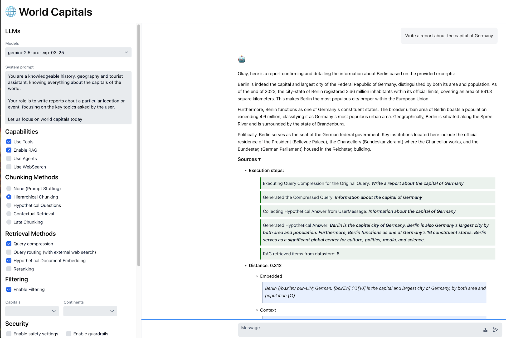
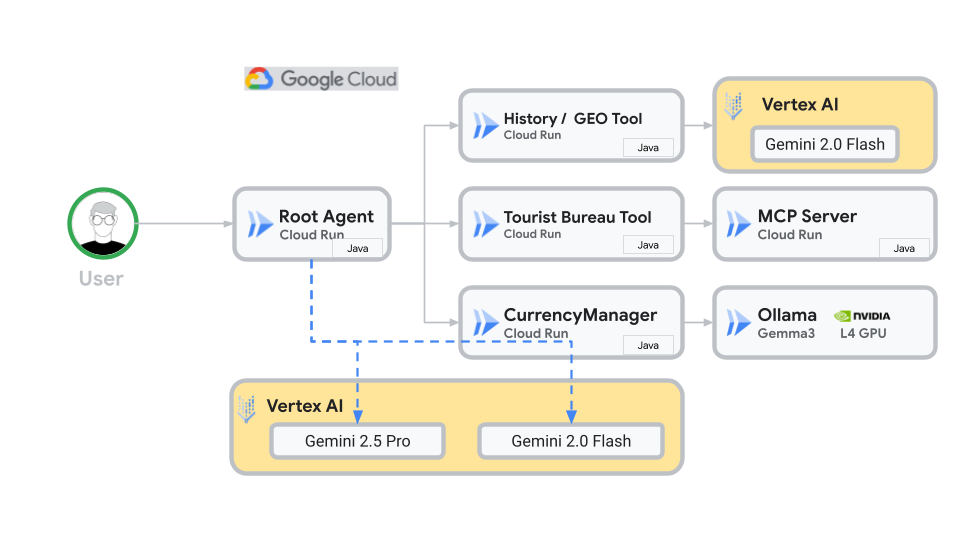

# AI Patterns w/UI front-end
#### Agent RAG UI Application, run locally or deploy to Cloud Run in Serverless GCP, w/GPU support

## App in action


## App Architecture


### Database
* Create an AlloyDB database in GCP - [Instructions](https://cloud.google.com/alloydb/docs/database-create)
* Create an instance of the AlloyDB database with the following [Database DDL](data/tables.ddl)

**Developer note:** use the AlloyDB proxy to run from your own development environment - [instructions](data/Database.md)

### Dependent Services
* MCP Servers
  * MCP Weather Server - [Deployment instructions](mcp/mcp-weather-server/README.md)
  * MCP File Server - [Deployment instructions](mcp/mcp-file-server/README.md)
* Gemma models with GPUs in Cloud Run
  * Ollama Container in Cloud Run with Gemma models - [Deployment instructions](ollama-cloud-run/README.md)

### Build and Deploy the Agentic RAG App
```shell
# start from debugger
AIPatternsWebApplication
```

Build and deploy
```shell
# build from CLI and start in dev mode, changes in UI code automatically reflected
./mvnw spring-boot:run

# build runnable JAR
./mvnw clean package -Pproduction
 
java -jar target/playground-0.0.1.jar
```

#### Set environment variables
```shell
export GCP_PROJECT_ID=<project>>
export GCP_PROJECT_NUM=<project_number>
export GCP_LOCATION=us-central1 
export ALLOY_DB_PASSWORD=...
export ALLOY_DB_URL=jdbc:postgresql://localhost:5432/library;
export ALLOY_DB_USERNAME=postgres

export GEMMA_URL=<optional> - Gemma model deployed in CloudRun
export TAVILY_API_KEY=<optional> - Tavily WebSearch API key for Query Routing with web search
export MCP_WEATHER_SERVER=<MCP-Server-URL>
export MCP_FILE_SERVER=<MCP-Server-URL>
export GCP_TEXTEMBEDDING_MODEL=textembedding-005
```

#### Note: Deploy MCP servers and Gemma models to Cloud Run before deploying the agent (optional)

#### Deploy to Cloud Run
```shell
# build Docker image
./mvnw spring-boot:build-image -DskipTests -Pproduction -Dspring-boot.build-image.imageName=agentic-rag

# tag image for Artifact Registry in GCP
docker tag agentic-rag us-central1-docker.pkg.dev/<Your Project>/agentic-rag/agentic-rag:latest

# push image to Artifact Registry in GCP
docker push us-central1-docker.pkg.dev/<Your Project>/agentic-rag/agentic-rag:latest

# Deploy image to Cloud Run
gcloud run deploy agentic-rag --image us-central1-docker.pkg.dev/<Your Project>/agentic-rag/agentic-rag:latest \
 --region us-central1 \
 --memory 2Gi --cpu 2 --cpu-boost --execution-environment=gen2 \
 --set-env-vars="SERVER_PORT=8080,GCP_PROJECT_ID=<project>,GCP_LOCATION=us-central1,GCP_PROJECT_NUM=<project_number>,ALLOY_DB_URL=<URL>,ALLOY_DB_USERNAME=<user>,GEMMA_URL=<optional>,MCP_WEATHER_SERVER=<MCP-Server-URL>,MCP_FILE_SERVER=<MCP-Server-URL>,GCP_TEXTEMBEDDING_MODEL=textembedding-005" \
 --set-secrets="ALLOY_DB_PASSWORD=ALLOY_DB_SECRET:latest,TAVILY_API_KEY=TAVILY_API_KEY:latest"

 
