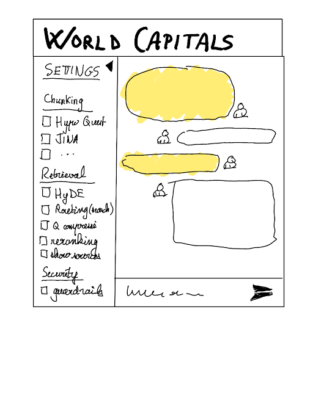
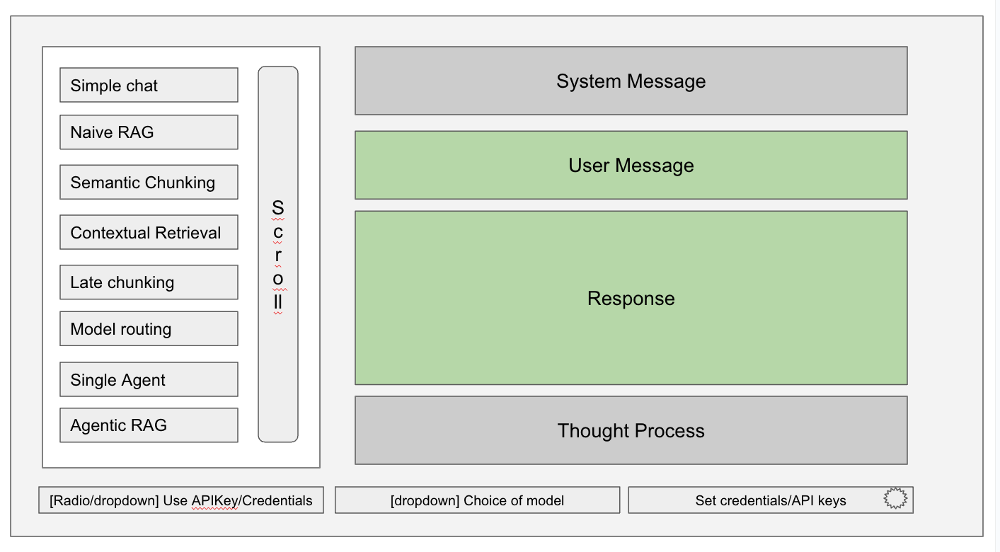

# ai-patterns-ui
**Anything in this repo is open to be changed, it is a shared working repo**

AI Patterns w/UI front-end, running locally or deployed in Serverless GCP

### Last updated: Sunday, Feb 09
3 sections:
* Starter app, added  Feb 09
* outline  from Guillaume - needs more explanations
* original content

## Starter app
* Spring Boot app, with Vaadin support, Java 21, LC4J 1.0.0-beta1, Boot 3.4.2
* starts with 2 endpoints, /chat and /call-agent 
* has 2 RestControllers (for testing now) and also 2 Vaadin Endpoints (to be wired into the UI), both leveraging @Services
* has actuator classes set up, for future deployment
* HistoryGeographyTool and TouristBureauMCPTool kept seld contained and just wired in as @Components

Env. variables: uses AstraDB, I will paste a key in the Git repo, under /Discussions - it is a private repo and the Astra account is free
```shell
export GCP_PROJECT_ID=<project>>
export GCP_LOCATION=us-central1 
export ASTRA_TOKEN=AstraCS:...
```

Models:
```shell
gemini-2.0-flash-001
gemini-2.0-flash-thinking-exp-01-21
gemini-2.0-pro-exp-02-05
```
Commands:
```shell
# basic chat
# the system message is set, and this setting just appends to it - for initial testing
curl -X POST   http://localhost:8080/chat   -H 'Content-Type: application/json'   -d '{
    "chatId": "user123",
    "systemMessage": "Return the response to the user",
    "userMessage": "Write a report about the population of Berlin, its geographic situation, its historical origins",
    "useVertex": "true",
    "chatModel": "gemini-2.0-flash-001"
  }'
  
# uses function calling, step-by-step
curl -X POST   http://localhost:8080/call-agent   -H 'Content-Type: application/json'   -d '{
    "chatId": "user123",
    "systemMessage": "Return the response to the user",
    "userMessage": "Write a report about the population of Berlin, its geographic situation, its historical origins",
    "useVertex": "true",
    "chatModel": "gemini-2.0-flash-001"
  }'  
  
# uses function calling, step-by-step, and also triggers a second function which uses MCP with a FileSystem
curl -X POST   http://localhost:8080/call-agent   -H 'Content-Type: application/json'   -d '{
    "chatId": "user123",
    "systemMessage": "Return the response to the user",
    "userMessage": "Write a report about the population of Berlin, its geographic situation, its historical origins, and find an article about the city in the FileSystem",
    "useVertex": "true",
    "chatModel": "gemini-2.0-flash-001"
  }'  
```


## Outline from Guillaume
Needs more explanations

* similar to the original in terms of choices for embedding, choice of models, etc
* adds a chat like interface
* similar interface with Vaadin ni Marcus' repo [here](https://github.com/marcushellberg/java-ai-playground) 




## Original content

#### Why this doc?
Developers are looking for guidance on implementing AI patterns in their enterprise applications.
Presenting such patterns in a UI-driven way is a good way to help them, especially when done in a workshop/conference/demo setting.

This doc is looking for guidance and examples on:
- how to present these patterns in a UI-driven way
- how to easily expand the sample app to include new patterns
- set up configuration for different models and credentials
- simplicity: idea on how to design a simple app, which is not all-consuming in terms of effort

#### Outcome:
- a sample app which will be extended in time, and updated with new patterns and models
- shared 
- retain the ability to be reused by all of us

#### Tech stack
- Spring Boot app 3.4.x
- Langchain4J 1.0.0-alpha* or GA
- Vaadin UI, w/Hilla
- Google AI + Google Vertex AI
- Locally / Cloud Run 
- Java 21 or 24 (post March 18)

#### where should it reside?
- for now in this repo
- a sample app is committed to this repo
- open-sourced when running

#### General ideas for using the app

(1) How should it look like, to be visiable, easily extendable?
A basic (strawman) mock-up of the UI:


(2) Should patterns be grouped by Intro/simple, ingestion, consumption, evaluation, agents, to avoid overwhelming the user?
Conversely, how should the `Endpoint` classes be designed, assuming the same approach?

(3) Best approach to easily expand the sample app to include new patterns?
For the backend, either a new `Endpoint` class or a new method in an existing `Endpoint` class can easily be added, and it would always include the choice of credentials and the model to use

(4) How to set up configuration for different models and credentials?
Should be in the spring boot starters, with env values set for API Key; read at start-up, and then used in the `Endpoint` class, with the dropdowns to plainly/easily list the models avaialable. `Service` classes to be created to handle the interaction with the AI models.

(5) Should the System Message be displayed all the time, together wityh User Message and response, or only available in a button click?

(6) same question for thinking models and (whenever available in the API) deep research models?

#### Existing sample app:
[Vaadin and Spring Boot (Vertex Gemini, LLama 3.1 in Vertex, LLama 3.1 in GKE)](https://github.com/GoogleCloudPlatform/serverless-production-readiness-java-gcp/tree/main/sessions/fall24/spring-ai-quotes-llm-in-gke)

Model choice (drop-down?)
- Gemini 2.0 Flash Exp
- Gemini 2.0 Flash Thinking Exp
- Claude Sonnet 3.5 v2
- Llama 3.1 model-as-a-service
- Embedding models - text-embedding-005 from Google and Jina embedding v3 from Jina.ai

Credentials (drop-down?)
- API key
- Vertex AI (Google Cloud) credentials
- Jina.ai API Key
