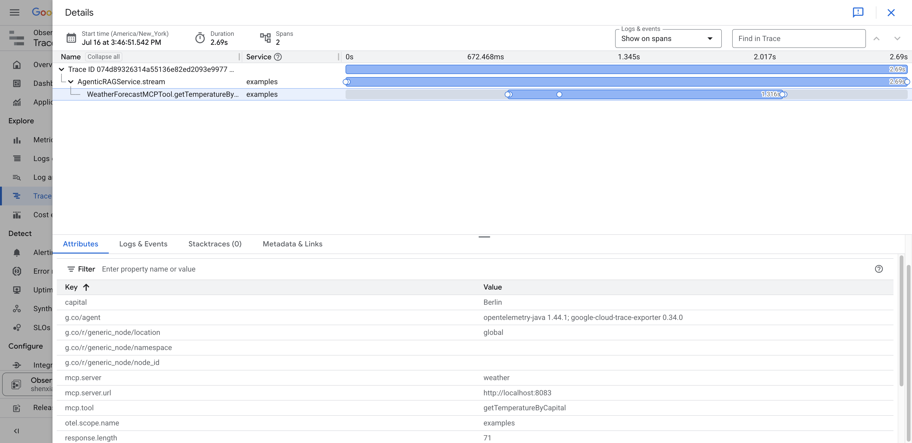

# OpenTelemetry Setup for Google Cloud Trace

This document explains how OpenTelemetry has been integrated into the AI Patterns UI application to send end-to-end trace data to Google Cloud Trace.

## Overview

OpenTelemetry is configured to automatically instrument the Spring Boot application and send trace data to Google Cloud Trace. This provides visibility into the application's performance and helps identify bottlenecks.

## Dependencies Added

The following dependencies were added to `pom.xml`:

```xml
<!-- OpenTelemetry Dependencies -->
<dependency>
    <groupId>io.opentelemetry.instrumentation</groupId>
    <artifactId>opentelemetry-spring-boot-starter</artifactId>
</dependency>
<dependency>
    <groupId>com.google.cloud.opentelemetry</groupId>
    <artifactId>exporter-trace</artifactId>
    <version>0.34.0</version>
</dependency>
<dependency>
    <groupId>io.opentelemetry</groupId>
    <artifactId>opentelemetry-exporter-otlp</artifactId>
</dependency>
```

Additionally, the OpenTelemetry BOM was added to dependency management:

```xml
<dependency>
    <groupId>io.opentelemetry.instrumentation</groupId>
    <artifactId>opentelemetry-instrumentation-bom</artifactId>
    <version>2.10.0</version>
    <type>pom</type>
    <scope>import</scope>
</dependency>
```

## Configuration

### Application Properties

The following properties were added to `application.properties`:

```properties
# OpenTelemetry Configuration
opentelemetry.traces.enabled=true
opentelemetry.logs.export.enabled=false
opentelemetry.metrics.export.enabled=false

# Google Cloud Trace Configuration
otel.traces.exporter=google_cloud_trace
otel.exporter.otlp.protocol=grpc
otel.resource.attributes=service.name=${spring.application.name},service.version=1.0.0

# GCP Project Configuration
gcp.project.id=${GCP_PROJECT_ID}
```

### OpenTelemetry Configuration Class

A configuration class `OpenTelemetryConfig` was created to set up the Google Cloud Trace exporter:

- Located at: `src/main/java/com/xiao/ai/patterns/config/OpenTelemetryConfig.java`
- Creates a `TraceExporter` for Google Cloud Trace
- Configures the `SdkTracerProvider` with resource attributes
- Provides a `Tracer` bean for manual instrumentation

## Manual Instrumentation

Key services have been instrumented with custom spans:

### AgenticRAGService

- **callAgent** method: Creates spans with attributes for chat ID and model
- **stream** method: Creates spans for streaming operations with proper lifecycle management

### ChatService

- **chat** method: Basic span creation with tool usage tracking
- **stream** method: Comprehensive instrumentation including:
  - RAG operations tracking
  - Query compression events
  - HyDE (Hypothetical Document Embedding) events
  - Guardrails/moderation tracking
  - Reranking operations

## Span Attributes and Events

The instrumentation captures:

- **Attributes**: chat.id, chat.model, streaming, rag.enabled, tools.enabled, guardrails.enabled
- **Events**: Building AI Assistant, Starting stream, Query compression, HyDE operations, RAG retrieval, Reranking
- **Metrics**: response.length, rag.items.retrieved

## Running with OpenTelemetry

1. Ensure the `GCP_PROJECT_ID` environment variable is set
2. Ensure Google Cloud credentials are configured
3. Run the application normally - traces will be automatically sent to Google Cloud Trace

## Viewing Traces

Traces can be viewed in the Google Cloud Console:
1. Navigate to the Trace section
2. Filter by service name (matches `spring.application.name`)
3. View detailed trace timelines and span attributes



## Disabling OpenTelemetry

To disable OpenTelemetry, set the following property:

```properties
opentelemetry.traces.enabled=false
```
